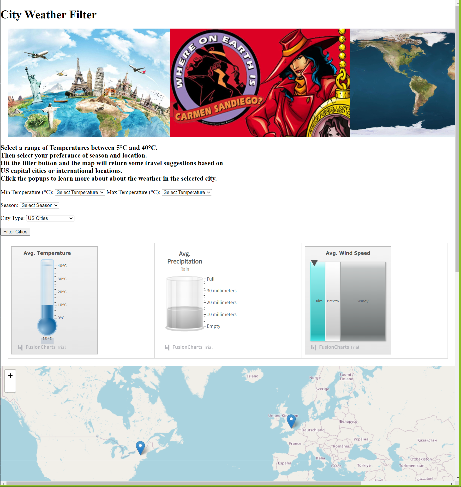

# Project-3-Weather Mapping

## Table of Contents

- [Project Outline](https://github.com/joshsound23/Project-3-Weather?tab=readme-ov-file#project-outline)

- [Cleaning Data](https://github.com/joshsound23/Project-3-Weather?tab=readme-ov-file#cleaning-the-data)

- [Java Script](https://github.com/joshsound23/Project-3-Weather?tab=readme-ov-file#java-script)

- [HTML Code](https://github.com/joshsound23/Project-3-Weather?tab=readme-ov-file#html-code)

- [Steps to run Code](https://github.com/joshsound23/Project-3-Weather?tab=readme-ov-file#steps-to-run-code)

- [Images](https://github.com/joshsound23/Project-3-Weather?tab=readme-ov-file#website-image)

- [Sources](https://github.com/joshsound23/Project-3-Weather?tab=readme-ov-file#data-source)

- [Collaborators](https://github.com/joshsound23/Project-3-Weather?tab=readme-ov-file#collaborators)

 
______________________________________________________________

# Project Outline:

In this project we will Create an interactive map that allows you to grab the average weather patterns of most major cities around the world.

We chose this topic as a project because we thought it would be interesting to see what the average weather patterns across the globe looks like. As it stands now our code will grab a random set of locations based off of the users filter inputs. Once the user clicks the filter button 10 random locations will pop up that meet the users criteria. 

The data we use comes from Guillem Servera at https://www.kaggle.com/datasets/guillemservera/global-daily-climate-data. This data set includes 3 documents, 2 csv and 1 parquet file we have to read in and convert to csv. 

The data sets are as follows:

*   cities.csv
*   countries.csv
*   daily_weather.parquet

## Cleaning the Data

These three data sets are meant to be used together. The largest challenge in the filtering and cleaning the data came from the daily_weather.parquet. this file had over 27 million lines of data. One interesting thing about this file is that it contained weather information dating back to 1957 and contained weather data for each day of the year since then. To make the information more presentable we cut a few of the columns that gave us the minimum and maximum temp, peak wind gust, avg sea level pressure, and avg wind direction. <!-- #We didn't want to over complicate the information that user's would be seeing.# -->Lastly we condensed the timetable to the last 5 full years. This weather data file did contain information on weather patterns in the year 2023 unfortunately, the file is 4 months out of date. So we chose to focus on the years between 2018-01-01 and 2023-01-01. Once the cleaning was done we imported all the files to mongoDB using the terminal commands:

MongoDB Import:
* mongoimport --type csv -d project3_weather -c weather_data --headerline --drop weather_data.csv
* mongoimport --type csv -d project3_weather -c countries --headerline --drop countries.csv
* mongoimport --type csv -d project3_weather -c cities --headerline --drop cities.csv

After all of that is done we start merging the data to make it easier to access using api calls. We do that using a mongodb python pipeline called mergeapp.py. 

Location: (prework_folder\mergeapp.py.) 

In this merge file we combine cities.csv and daily_weather.csv. After these files are merged we can use our flask app to access our mongodb database.

The major challenge that we faced in this project was getting all 3 different code files to work together. We have our front end which is our dashboard.js file, our backend flask app called app.py and our html code index.html which will display all the information. 

## Java script
Our java script code does two major things, 1. It places markers on our interactive map, and 2. it binds information and charts to that marker. We added an onclick function so when the user clicks the marker it tell them the name and country of the markers placement. When clicked the marker will also update the weather charts. We used a special weather visualization charting tool that can be found in Fusioncharts library (https://www.fusioncharts.com/). The 3 charts show temperature, precipitation measured in mm, and avg wind speed measured in calm breezy and windy. Our code gets in locations and averages from the flask app.py

## Flask App
 Our flask app connects to our database, and then depending on the filter inputs will give the user 10 random locations that fit in line with 3 filter criteria. These filters are, inputs for a minimum and maximum temperature, one of the 4 seasons listed in the drop down (summer, autumn, winter and spring), and finally if the user is looking for US based cities or international cities. Depending on the filter inputs the flask will grab 10 random cities that match the specified inputs. 

 ## HTML Code
 Our html code works in tandem with the other two files. or html code is a little special in that is not only our front facing display but also contains code for feting the weather data from our json files and filters them. This helps with simplifying the amount of Java script code we have to write and makes accessing the information easier.
________________________________________________________________________
## Steps to run code
### Step One
Go to the resources\cleaned_resources and unzip the weather_data.zip file. Then run these imports in the Terminal located in that folder.

MongoDB Import:
* mongoimport --type csv -d project3_weather -c weather_data --headerline --drop weather_data.csv
* mongoimport --type csv -d project3_weather -c countries --headerline --drop countries.csv
* mongoimport --type csv -d project3_weather -c cities --headerline --drop cities.csv

### Step Two
Go to prework_folder and run the mergeapp.py file. !!Note this may take some time, as these are fairly large data sets!!

### Step Three
Now you can Run the app.py file located at the front of the PROJECT-3-WEATHER folder.

________________________________________________________________________
## Website Image

________________________________________________________________________

## Data Source:
https://www.kaggle.com/datasets/guillemservera/global-daily-climate-data

https://www.fusioncharts.com/

________________________________________________________________________
### Collaborators:

Josh Soundarajan, 
Nathan Kaspar,
Ben Belczak,
Matthew Hill,
Stephanie Carlson.

